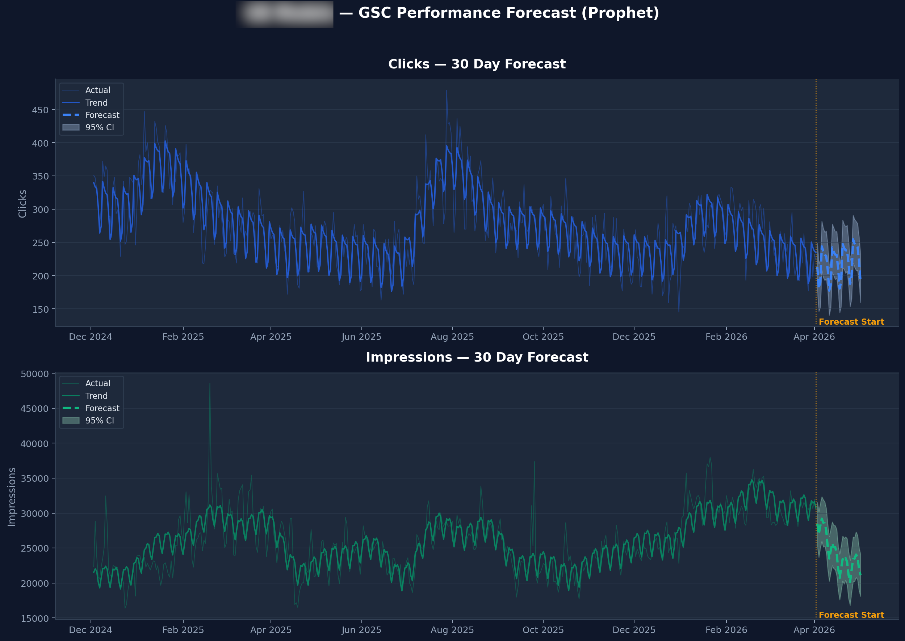
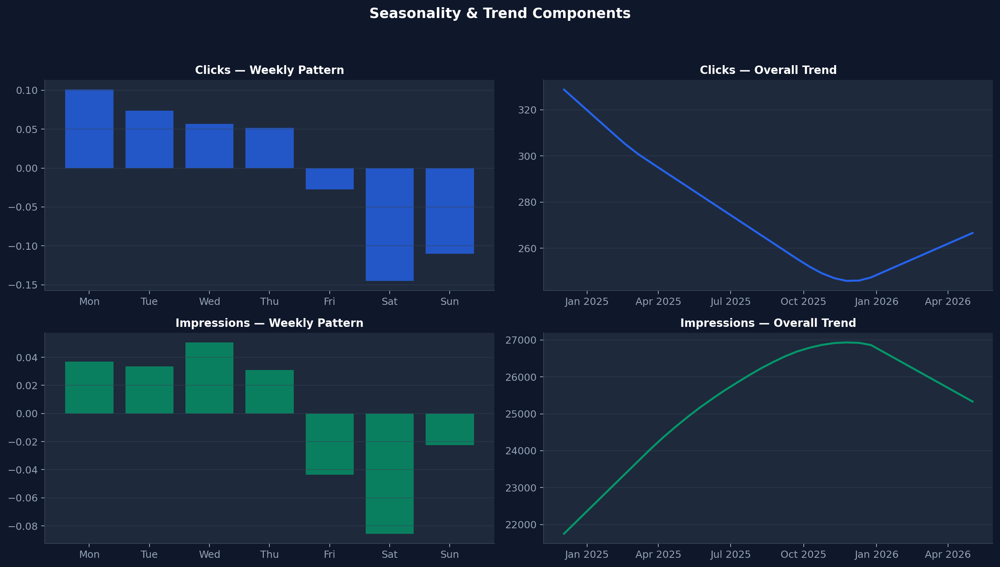
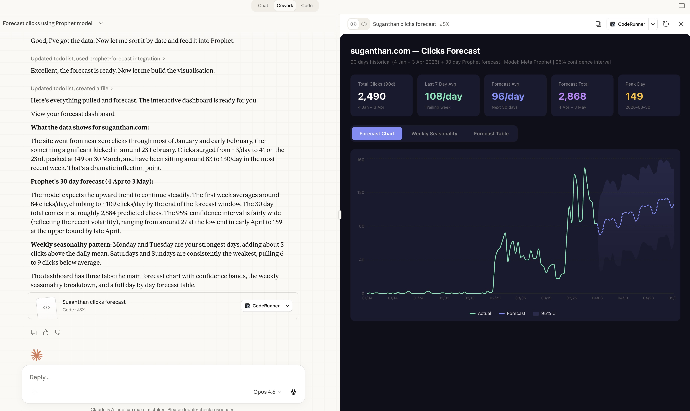
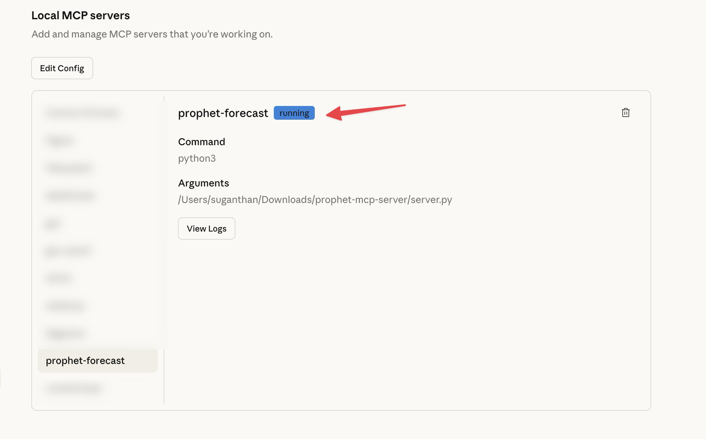

# Prophet MCP Server

Statistical traffic forecasting for SEO using Meta's Prophet. Connects to Claude Desktop as an MCP server.

I tested Claude, ARIMA, and Prophet against 486 days of real GSC data. All 3 landed within 10% of each other on the headline number, but Prophet delivered the tightest confidence bands (34% narrower than ARIMA) and quantified weekly seasonality that neither of the others could match. 

Full writeup with results: **[I Tested 3 Ways to Forecast SEO Traffic](https://suganthan.com/blog/forecast-seo-traffic-prophet-claude-code/)**





## What it does

Three tools available in Claude Desktop once connected.

**forecast_traffic** takes daily date/value pairs (clicks, impressions, or any metric from GSC) and returns a full forecast with trend analysis, 95% confidence intervals, and weekly seasonality patterns. Claude calls this automatically when it already has your data from another MCP server like [GSC MCP](https://github.com/Suganthan-Mohanadasan/Suganthans-GSC-MCP) or [BigQuery MCP](https://github.com/Suganthan-Mohanadasan/Suganthans-BigQuery-MCP-Server).

**forecast_from_csv** reads a CSV file and auto-detects date and value columns. Works with Google Search Console exports out of the box. Point it at any CSV with a date column and a numeric column.

**forecast_chart** generates an interactive Plotly chart saved as an HTML file. Includes historical data, forecast line, 95% confidence band, trend line, and event annotations. Opens automatically in your browser. Zoomable, pannable, downloadable as PNG.

## Event annotations

All three tools accept event annotations. These tell Prophet about known events that may have affected your traffic: algorithm updates, site migrations, content launches, redirects, anything that caused a spike or dip.

Prophet doesn't just plot these as markers. It treats them as special events in the statistical model, which improves forecast accuracy by preventing the model from treating event-driven changes as organic patterns.

```
Forecast my daily clicks for the next 30 days using Prophet with these events:
- 2026-01-15: March core update (window_after: 14)
- 2026-02-20: site migration (window_before: 3, window_after: 21)
- 2026-03-01: new blog section launched (window_after: 7)
```

Each event accepts:
- **date**: when it happened (YYYY-MM-DD)
- **label**: short description
- **window_before**: days before the event it may have had impact (default: 1)
- **window_after**: days after the event it may have had impact (default: 3)

You can also load events from a CSV file using the `events_csv` parameter in `forecast_from_csv`. The CSV needs `date` and `label` columns, with optional `window_before` and `window_after` columns.

## Interactive charts

The `forecast_chart` tool generates an interactive HTML chart using Plotly.

```
Pull my daily clicks for the last 90 days and create a Prophet forecast chart for the next 30 days
```

The chart includes:
- Historical data as scatter points
- Forecast line with shaded 95% confidence band
- Dotted trend line across the full range
- Red vertical markers for event annotations with labels
- Hover tooltips with exact values
- Saved to your Desktop as `prophet_forecast.html` (or specify a custom path)

## Example output

Ask Claude to pull your GSC data and forecast with Prophet. It chains the tools automatically.

> Pull my daily clicks for the last 90 days and forecast the next 30 days using Prophet



You get trend direction, daily predictions with upper and lower bounds, and a weekly seasonality breakdown showing exactly which days perform best.

### Example prompts

- "Pull my daily clicks for the last 90 days and forecast the next 30 days using Prophet"
- "Forecast the next 30 days using Prophet from this CSV"
- "Pull my daily impressions for the last 90 days and forecast the next 90 days using Prophet"
- "Pull daily clicks for just /blog/my-post/ for the last 90 days and forecast the next 60 days using Prophet"
- "Forecast my clicks for 30 days with these events: core update on 2026-01-15, migration on 2026-02-20"
- "Create a Prophet forecast chart for my daily clicks over the next 60 days"

Include "using Prophet" in your prompt so Claude routes the computation to the MCP server instead of estimating the numbers itself.

## Setup

### 1. Install dependencies

```bash
pip3 install prophet mcp pandas plotly
```

### 2. Clone the repo

```bash
git clone https://github.com/Suganthan-Mohanadasan/prophet-mcp-server.git
```

### 3. Add to Claude Desktop

Open Claude Desktop settings, go to Developer > Edit Config.

**macOS**
```json
{
  "mcpServers": {
    "prophet-forecast": {
      "command": "python3",
      "args": ["/absolute/path/to/prophet-mcp-server/server.py"]
    }
  }
}
```

**Windows**
```json
{
  "mcpServers": {
    "prophet-forecast": {
      "command": "python",
      "args": ["C:\\absolute\\path\\to\\prophet-mcp-server\\server.py"]
    }
  }
}
```

Replace the path with wherever you cloned the repo. Save the file and restart Claude Desktop.

### 4. Verify

Go to Settings > Developer. You should see **prophet-forecast** with a running badge.



## Works with other MCP servers

Prophet chains with other MCP servers through Claude. If you also have the GSC MCP or BigQuery MCP connected, Claude pulls the data from one server and passes it to Prophet for forecasting. One prompt, two tools, no manual data wrangling.

| MCP Server | What it provides |
|---|---|
| [GSC MCP](https://github.com/Suganthan-Mohanadasan/Suganthans-GSC-MCP) | Live GSC data (clicks, impressions, CTR, position) |
| [BigQuery MCP](https://github.com/Suganthan-Mohanadasan/Suganthans-BigQuery-MCP-Server) | Historical GSC data warehouse (486+ days) |
| **Prophet MCP** | Statistical forecasting on any of the above |

## Requirements

- Python 3.8+
- No GPU needed
- Works on Mac, Windows, and Linux
- Runs in under 2 seconds on typical SEO datasets
- All data stays on your machine
- Plotly is optional (only needed for `forecast_chart`)

## How it works

Prophet decomposes your time series into trend, weekly seasonality, and yearly seasonality (365+ days of data). It projects these components forward with 95% confidence intervals. The same approach Meta's data science team uses for their own business forecasting.

When you add event annotations, Prophet includes them as additional regressors in the model. This means a traffic spike from an algorithm update won't bleed into your baseline forecast. The model learns the event's impact separately from the organic trend, giving you cleaner predictions.

## Blog post

Full comparison of Claude vs ARIMA vs Prophet with real data and results: **[I Tested 3 Ways to Forecast SEO Traffic. Here Is What Actually Works.](https://suganthan.com/blog/forecast-seo-traffic-prophet-claude-code/)**

## Licence

Apache 2.0
